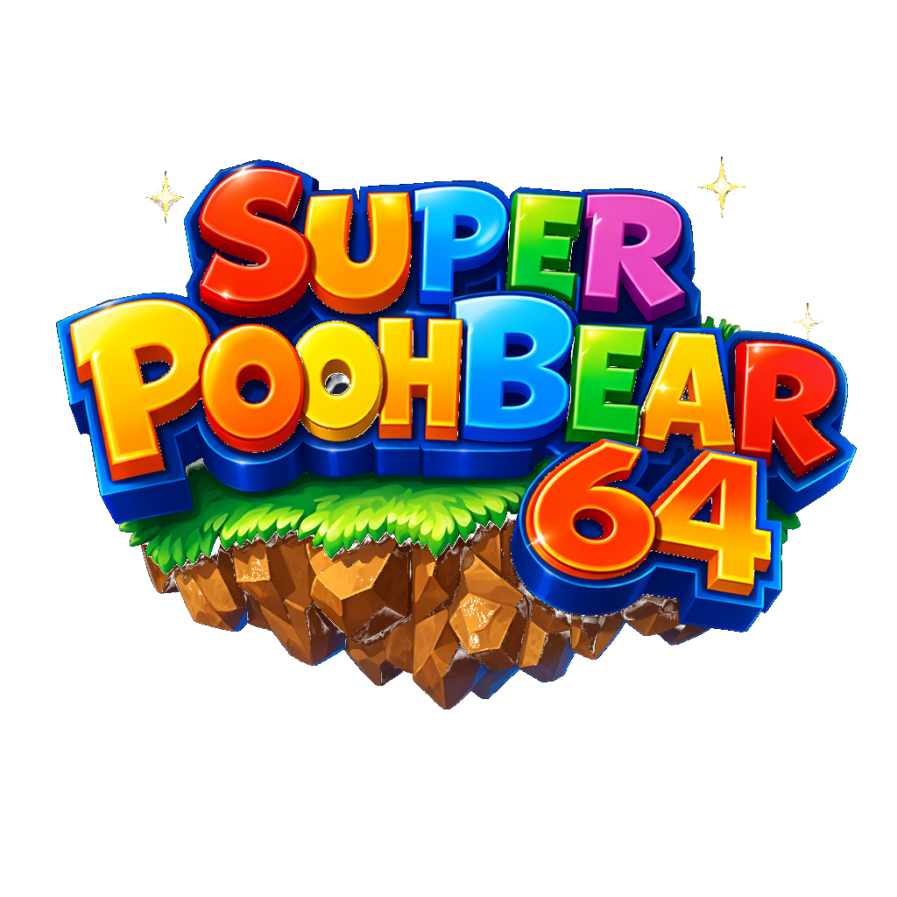

# Super Pooh Bear 64

<div align="center">
  
</div>

## 1. Identificação do Projeto
- **Título do Projeto:** Super Pooh Bear 64
- **Desenvolvedor: Ueslei Carvalho: https://github.com/uesleisouza33**
- **Product Owner: Carlos Silva: https://github.com/Prof-Carlos-Senai**

---

## 2. Visão Geral do Sistema

- **Descrição:** O software trata-se de um game interativo de plataforma 2D baseado em web (criado utilizando HTML, CSS e JavaScript Vanilla).
- **Objetivo:** O objetivo principal é ser um game de plataforma, aventura e coleta onde o jogador deve resgatar os amigos do Pooh.
- **Tema:** Uma aventura pela floresta onde o Leitão foi capturado e está preso! O urso Pooh precisa reunir seus potes de mel favoritos para revelar a chave que libertará o seu amigo antes que o tempo acabe.
- **Instruções de Jogabilidade:**
  - `⬅` `➡` ou `A` / `D` → Andar
  - `⬆` ou `ESPAÇO` → Pular
  - `ENTER` → Avançar diálogos
  - **Inimigos:** 🐝 Abelhas tiram vida ao encostar; 🗡️ Espinhos causam morte instantânea.
  - **Coletáveis:** 🍯 Colete 5 potes de mel espalhados pelo mapa para revelar a 🔑 Chave, que você deve pegar para concluir e avançar de fase.
- **Especificações Técnicas:**
  - *Progressão de Fases:* Concluída obrigatoriamente pela coleta dos cinco itens de mel no nível e acesso à chave revelada.
  - *Vidas:* Sistema de vida com corações e checkpoints (dano de encostar em inimigos comuns vs hit-kill de armadilhas como espinhos).
  - *Pontuação/Tempo:* O desafio baseia-se em realizar a missão dentro de um contador de tempo limitado.
- **Requisitos e Regras (Software):**
  - *Requisitos Funcionais:* Controle de física e estado (gravidade, colisão); Mecanismo de coleta de itens espalhados pelos obstáculos e acompanhamento do progresso em tempo real pela HUD.
  - *Requisitos Não Funcionais:* Performance em navegadores web populares; Responsividade limitada aos controles propostos e dimensões (tamanho de canvas/tela) pré-estabelecidas para desktops.
  - *Regras de Negócio:* A condição de vitória de uma fase exige estritamente recolher 100% da cota de mel para materializar a chave da porta final.
- **Créditos:**
  - **Aluno:** Ueslei Carvalho
  - **Product Owner (Professor Orientador):** [Inserir nome do professor]
- **Link de Produção:** [Inserir Link de Produção gerado na Vercel]

---

## 3. Instruções de Instalação e Execução

Para rodar este projeto em sua máquina de maneira local (para fins de desenvolvimento ou jogar offline), siga o passo-a-passo:

1. **Clonagem do Repositório:**
   Feito por meio do Git Bash ou terminal de preferência:
   ```bash
   git clone https://github.com/uesleisouza33/super_pooh_bear.git
   ```

2. **Execução do Projeto:**
   Você tem duas opções para abrir e jogar:
   - **Forma Nativa:** Navegue até a pasta do projeto via explorador de arquivos e clique duas vezes em `index.html` para abrir diretamente no seu navegador.
   - **Forma Servidor (Recomendado):** Utilize a extensão **Live Server** no seu VSCode ou inicie um módulo via terminal (ex.: `npx serve .` ou com a extensão `live server`) para rodar `index.html`. Evite problemas com protocolos de carregamento e Cross-Origin em navegadores modernos manipulando áudio/imagem do sistema via JS.

---

## 4. Link do Vercel do Sistema em Produção

Jogue a versão estendida e já pronta direto do seu navegador acessando a URL abaixo:

🚀 **[Link do Vercel: https://super-pooh-bear.vercel.app/]**
